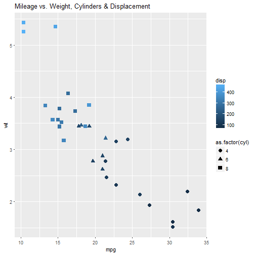

Determining Fuel-Efficiency
========================================================
author: Reinhard Stockinger
date: May 19, 2017
autosize: true
css: style.css

The Problem Space
========================================================

Fuel efficiency is related to several factors:

- Engine horsepower
- Vehicle weight
- Transmission type
- Engine Displacement
- and more…

Vehicle Data
========================================================

The `mtcars` dataset provides us with some fairly rich
data to explore:

```r
summary(mtcars)
```

```
      mpg             cyl             disp             hp       
 Min.   :10.40   Min.   :4.000   Min.   : 71.1   Min.   : 52.0  
 1st Qu.:15.43   1st Qu.:4.000   1st Qu.:120.8   1st Qu.: 96.5  
 Median :19.20   Median :6.000   Median :196.3   Median :123.0  
 Mean   :20.09   Mean   :6.188   Mean   :230.7   Mean   :146.7  
 3rd Qu.:22.80   3rd Qu.:8.000   3rd Qu.:326.0   3rd Qu.:180.0  
 Max.   :33.90   Max.   :8.000   Max.   :472.0   Max.   :335.0  
      drat             wt             qsec             vs        
 Min.   :2.760   Min.   :1.513   Min.   :14.50   Min.   :0.0000  
 1st Qu.:3.080   1st Qu.:2.581   1st Qu.:16.89   1st Qu.:0.0000  
 Median :3.695   Median :3.325   Median :17.71   Median :0.0000  
 Mean   :3.597   Mean   :3.217   Mean   :17.85   Mean   :0.4375  
 3rd Qu.:3.920   3rd Qu.:3.610   3rd Qu.:18.90   3rd Qu.:1.0000  
 Max.   :4.930   Max.   :5.424   Max.   :22.90   Max.   :1.0000  
       am              gear            carb      
 Min.   :0.0000   Min.   :3.000   Min.   :1.000  
 1st Qu.:0.0000   1st Qu.:3.000   1st Qu.:2.000  
 Median :0.0000   Median :4.000   Median :2.000  
 Mean   :0.4062   Mean   :3.688   Mean   :2.812  
 3rd Qu.:1.0000   3rd Qu.:4.000   3rd Qu.:4.000  
 Max.   :1.0000   Max.   :5.000   Max.   :8.000  
```

Visualizing the Data
========================================================


What's The Biggest Impact?
========================================================

```r
fit <- lm(mpg ~ wt + cyl + disp + hp, data = mtcars)
summary(fit)
```

```

Call:
lm(formula = mpg ~ wt + cyl + disp + hp, data = mtcars)

Residuals:
    Min      1Q  Median      3Q     Max 
-4.0562 -1.4636 -0.4281  1.2854  5.8269 

Coefficients:
            Estimate Std. Error t value Pr(>|t|)    
(Intercept) 40.82854    2.75747  14.807 1.76e-14 ***
wt          -3.85390    1.01547  -3.795 0.000759 ***
cyl         -1.29332    0.65588  -1.972 0.058947 .  
disp         0.01160    0.01173   0.989 0.331386    
hp          -0.02054    0.01215  -1.691 0.102379    
---
Signif. codes:  0 '***' 0.001 '**' 0.01 '*' 0.05 '.' 0.1 ' ' 1

Residual standard error: 2.513 on 27 degrees of freedom
Multiple R-squared:  0.8486,	Adjusted R-squared:  0.8262 
F-statistic: 37.84 on 4 and 27 DF,  p-value: 1.061e-10
```

From this regression we can see that vehicle weight (`wt`)
has the biggest impact on fuel-efficiency.
